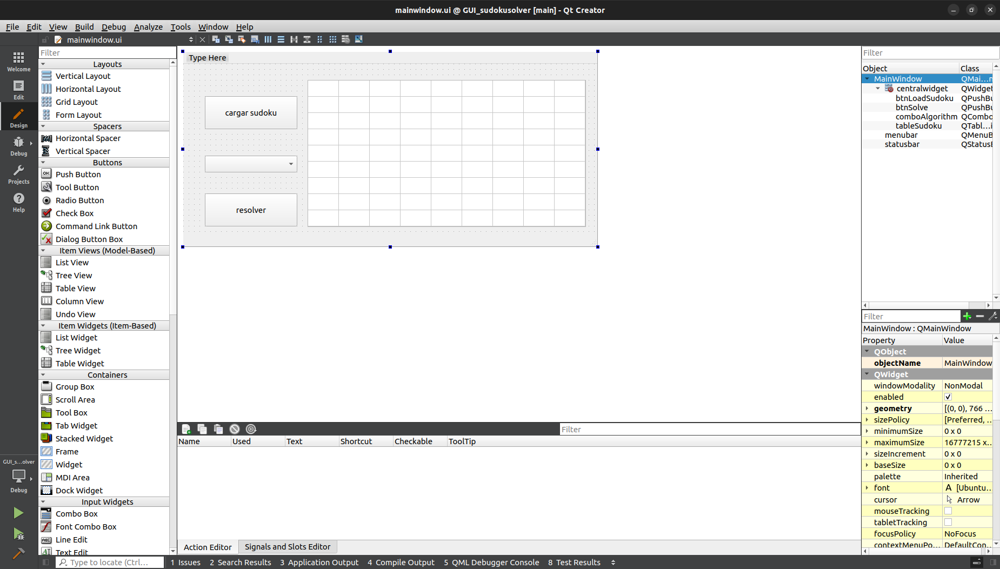

# sudoku solver project
El desarrollo de este proyecto está basado en el lenguaje de programación C++ integrando múltiples técnicas de resolución como Depth-First Search (DFS), Forward Checking y Cross-Hatching. Esta última parte del proyecto busca implementar una GUI (Graphic User Interface) que permite cargar, escoger un algoritmo y resolver un sudoku correctamente formateado, a través de Qt Creator.  
  
Los archivos correspondientes al proyecto en Qt Creator que manejan la gestión de la aplicación y el diseño de la interfaz gráfica son: [GUI_sudokusolver.pro](GUI_sudokusolver.pro), [GUI_sudokusolver.pro.user](GUI_sudokusolver.pro.user), [main.cpp](main.cpp), [mainwindow.cpp](mainwindow.cpp), [mainwindow.h](mainwindow.h) y [mainwindow.ui](mainwindow.ui). Los archivos que contienen la clase base Sudoku y las clases derivadas para cada algoritmo son: [Sudoku.cpp](Sudoku.cpp), [Sudoku.h](Sudoku.h), [SudokuCrossHatching.cpp](SudokuCrossHatching.cpp), [SudokuCrossHatching.h](SudokuCrossHatching.h), [SudokuDFS.cpp](SudokuDFS.cpp), [SudokuDFS.h](SudokuDFS.h), [SudokuForwardChecking.cpp](SudokuForwardChecking.cpp) y [SudokuForwardChecking.h](SudokuForwardChecking.h).
En la aplicación se realiza la build y se obtiene el ejecutable.  
Al ejecutar [GUI_sudokusolver.out](GUI_sudokusolver.out) se visualiza la siguiente ventana:
  
Al hacer click en el botón cargar sudoku se abre una ventana que permite seleccionar un archivo de sudoku en formato .txt y se visualiza en la interfaz. En [test sudokus](test%20sudokus) se encuentran sudokus formateados disponibles para ser resueltos.  
  
Al hacer click en el combobox se despliega una lista de opciones de algoritmos, se puede seleccionar entre los tres algoritmos.  
  
Una vez seleccionado el algoritmo al hacer click en el botón resolver, el sudoku es resuelto y mostrado en la interfaz con la solución.  
  
  
